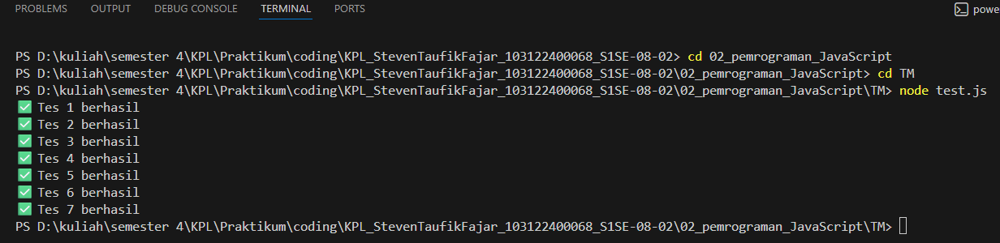

# Tugas Pendahuluan 02: Pemrograman JavaScript

## Soal
Buatlah sebuah fungsi bernama fizzBuzz yang menerima input larik (array) dan mengembalikan deretan bilangan dan "Fizz" untuk kelipatan 2, "Buzz" untuk kelipatan 7, dan "FizzBuzz" untuk kelipatan 14. Beri nama berkas program sebagai tm.js dan taruh di direktori TM.

## Kode sumber

Tersedia di [test.js](./test.js)
tm.js (./tm.js)

## Output


## Deskripsi Program

Program ini berisi fungsi fizzBuzz yang menerima input berupa array dan menghasilkan output berupa string. Fungsi ini kemudian diekspor menggunakan module.exports agar dapat diuji menggunakan test.js.

Pada fungsi fizzBuzz terdapat validasi input:
```
if (!Array.isArray(params)) {
    return "Input tidak valid";
}
```
Kode ini berfungsi untuk memastikan bahwa input berupa array. Jika bukan array, maka fungsi langsung mengembalikan teks "Input tidak valid".

Selanjutnya dilakukan perulangan menggunakan for untuk memeriksa setiap elemen dalam array params:
```
for (let i = 0; i < params.length; i++) {
    if (params[i] % 14 === 0) {
        result.push("FizzBuzz");
    }
    else if (params[i] % 2 === 0) {
        result.push("Fizz");
    }
    else if (params[i] % 7 === 0) {
        result.push("Buzz");
    }
    else {
        result.push(params[i]);
    }
}
```
Pada bagian ini setiap angka diperiksa apakah merupakan kelipatan 14, 2, atau 7 menggunakan operator modulus %. Jika kelipatan 14 maka dimasukkan "FizzBuzz", jika kelipatan 2 dimasukkan "Fizz", jika kelipatan 7 dimasukkan "Buzz", dan jika tidak memenuhi kondisi tersebut maka angka aslinya dimasukkan ke dalam array result.

Setelah semua elemen diproses, array result digabung menjadi string menggunakan join() dengan pemisah tertentu agar sesuai dengan format output pada test.js. Terakhir fungsi diekspor menggunakan:
```
module.exports = fizzBuzz;
```