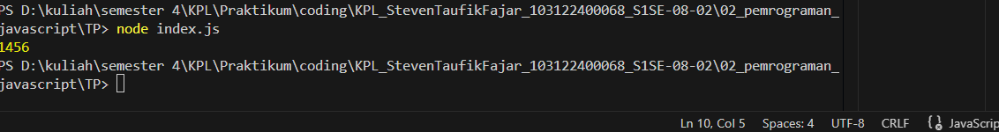

# Tugas Pendahuluan 02: Pemrograman JavaScript
Nama: Steven Taufik Fajar
NIM: 103122400068
Kelas: SE-08-02

## Soal
Kamu sudah menulis fungsi mulOfArray. Ujilah dengan input [2, 0, 26, 28, -2], dengan output yang seharusnya adalah 1456. Jika kamu menemukan bahwa hasilnya berbeda, bisakah kamu memperbaikinya? Jika kamu menemukan bahwa hasilnya sama, bisakah kamu menjelaskan mengapa demikian?
## Kode Sumber
[index.js] (./index.js)
[index.js] (./index.js)
## Output

## Deskripsi Program

Program ini menjalankan perkalian semua bilangan positif dalam larik (array). Ini akan bekerja untuk bilangan positif, nol, dan negatif.
