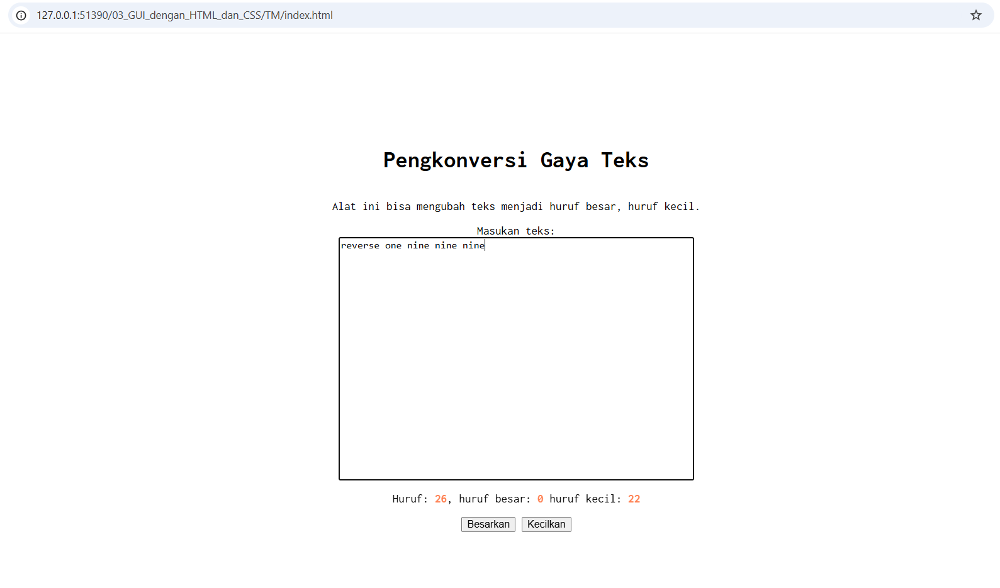
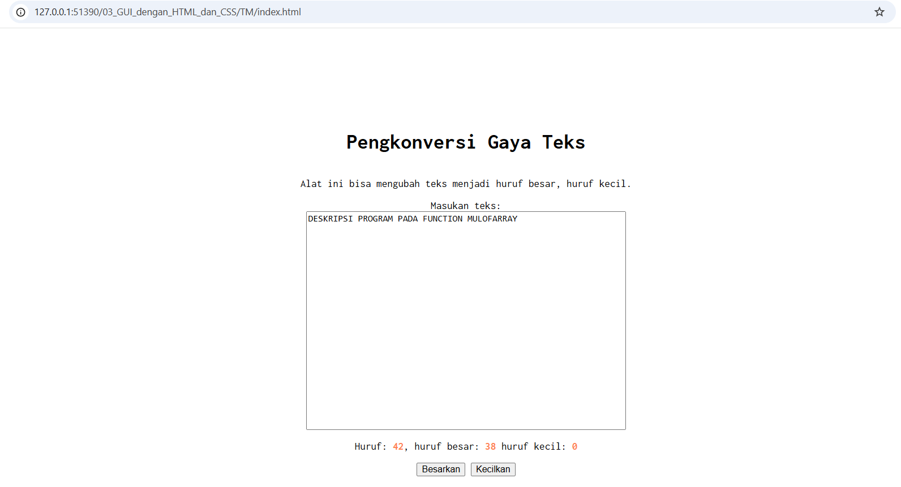
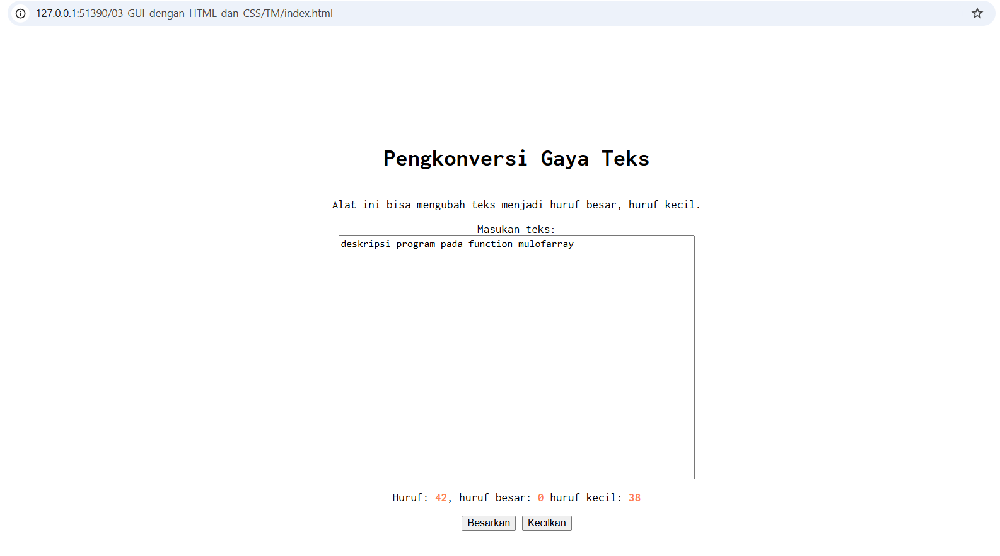

# Tugas Mandiri 03: Pemrograman GUI dengan HTML dan CSS
Nama: Steven Taufik Fajar
NIM: 103122400068
Kelas: SE-08-02

## Soal
Setelah kamu menyelesaikan tugas pendahuluan (bisa buka di atas), terapkanlah fungsi untuk (1) menghitung huruf kecil yang disediakan di #hk, (2) mengubah huruf kecil ke huruf besar ketika pengguna menekan tombol #huruf-besar, dan (3) mengubah huruf besar ke huruf kecil ketika pengguna menekan tombol #huruf-kecil.

Untuk nomor 2 dan 3, tampilkan hasilnya di dalam editor-kecil.

Kemudian, hapuslah fitur "Paragrafkan" dari alat.

## Program/kode
[index.html](./index.html) [index.css](./index.css) [index.js](./index.js)


## Output
(1) menghitung huruf kecil yang disediakan di #hk,

(2) mengubah huruf kecil ke huruf besar ketika pengguna menekan tombol #huruf-besar,

(3) mengubah huruf besar ke huruf kecil ketika pengguna menekan tombol #huruf-kecil.


## Deskripsi
(1) Program di bawah ini fungsinya menghitung huruf dengan melakukan perulangan
untuk mengecek setiap karakter apakah karakternya huruf kecil dari a sampai z
jika benar maka menampilkan hasil hitungan
```
editorElement.addEventListener("input", function() {
    let text = editorElement.value;
    charCountElement.textContent = text.length;
    
    let hitungHurufKecil = 0;
    let hitungHurufBesar = 0;

    for (let i = 0; i < text.length; i++) {
        let karakter = text[i];
        
        if (karakter >= 'a' && karakter <= 'z') {
            hitungHurufKecil++;
        } else if (karakter >= 'A' && karakter <= 'Z') {
            hitungHurufBesar++;
        }
    }
    
    lowerCountElement.textContent = hitungHurufKecil;
    upperCountElement.textContent = hitungHurufBesar;
});
```
(2) ini fungsinya untuk membesarkan text yg kita inputkan
```
btnBesar.addEventListener("click", function(){
        editorElement.value = editorElement.value.toUpperCase();
        editorElement.dispatchEvent(new Event('input'));
});
```
(3) ini fungsinya untuk mengecilkan text yg kita inputkan
```
btnKecil.addEventListener("click", function(){
    editorElement.value = editorElement.value.toLowerCase();
    editorElement.dispatchEvent(new Event('input'));
});
```
