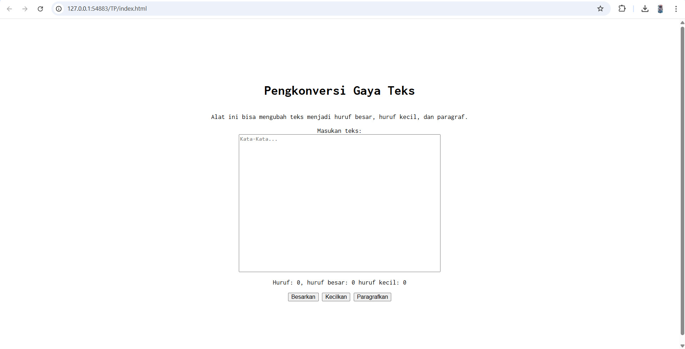

# Tugas Pendahuluan 03: Pemrograman GUI dengan HTML dan 

## Soal
Buatlah tata letak laman yang kamu buat berada di tengah seperti di bawah ini, dan juga ubah font-nya dengan Inconsolata dari Google Fonts.

## Kode sumber

Tersedia di [index.js](index.js)

[index.html](index.html)

[index.css](index.css)

## Output


## Deskripsi Program 
## Deskripsi Program
INI FUNGSINYA UNTUK MEMBUAT BUTTON/TOMBOL
```html
<p>
    Huruf: <span id="hf">0</span>,
    huruf besar: <span id="hb"> 0</span>
    huruf kecil: <span id="hk">0</span>
</p>
<div>
    <button id="huruf-besar">Besarkan</button>
    <button id="huruf-kecil">Kecilkan</button>
    <button id="huruf-paragraf">Paragrafkan</button>
</div>
```

INI UNTUK MENAMBAHKAN FONT YANG DI SOAL DAN MEMBUAT SEMUA ITEM ADA DI TENGAH
```css
body{
    font-family: "Inconsolata", monospace;
    font-weight: 400;
    display: flex;
    flex-direction: column;
    align-items: center;
    justify-content: center;
    min-height: 100vh;
}
```