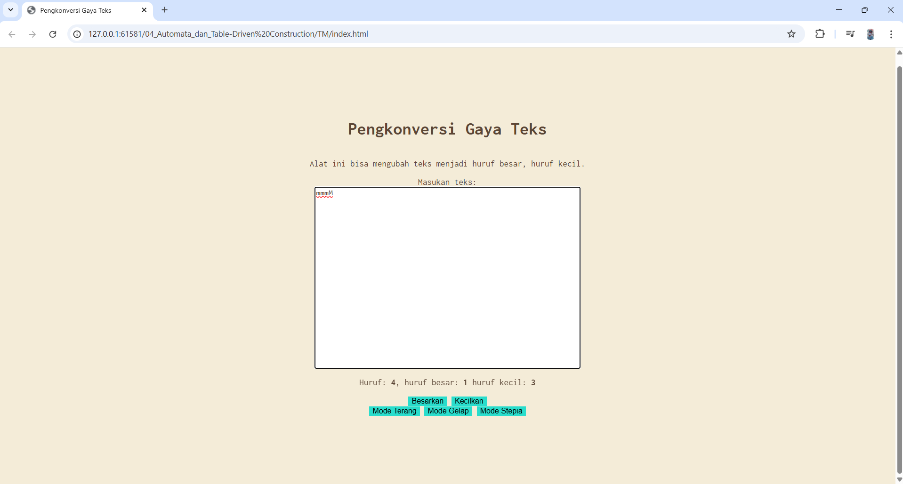

# Tugas Mandiri 04: Automata dan Table-Driven Construction
Nama: Steven Taufik Fajar
NIM: 103122400068
Kelas: SE-08-02

## Soal
Tambahkan mode sepia dengan ketentuan:

Elemen	Warna
Latar belakang	#F4ECD8
Warna teks	#5B4636
Biarkan form tetap warna putih.

Ketentuan lainnya:

Bagian mode-div harus menaungi tiga button: light, dark, dan sepia
Bisa berpindah state secara mulus: sepia menghasilkan sepia-mode, dark menghasilkan dark-mode, dan light menghasilkan light-mode

## Program/kode
[index.html](./index.html) [index.css](./index.css) [index.js](./index.js)


## Output


## Deskripsi
(1) Program di bawah ini saya menambahkan .Stepia-mode untuk 
mengubah tampilan warna dan fungsi tombol Stepia ada di html
sesuai yang di minta di soal, 
```
.Stepia-mode {
    background-color: #F4ECD8;
    color: #5B4636;
}
.Stepia-mode .kotak-input{
    background-color: white;
    color: #5B4636;
}
.Stepia-mode button {
    background-color: #29ddcc;
    border: none;
}
```

lalu saja menambahkan ini di js agar pada saat berpindah dari dark mode ke stepia 
mode atau sebaliknya tidak saling menimpa jadi ketika pindah ke mode stepia lalu ke 
dark mode atau sebaliknya, salah satunya akan terhapus tampilnnya
```
buttonLightElement.addEventListener("click", (event)=>{
    document.documentElement.classList.remove("dark-mode", "Stepia-mode");
});
buttonDarkElement.addEventListener("click", (event)=>{
    document.documentElement.classList.remove("Stepia-mode"); 
    document.documentElement.classList.add("dark-mode");
});

buttonStepiaElement.addEventListener("click", (event)=>{
    document.documentElement.classList.remove("dark-mode"); 
    document.documentElement.classList.add("Stepia-mode");
});
```
