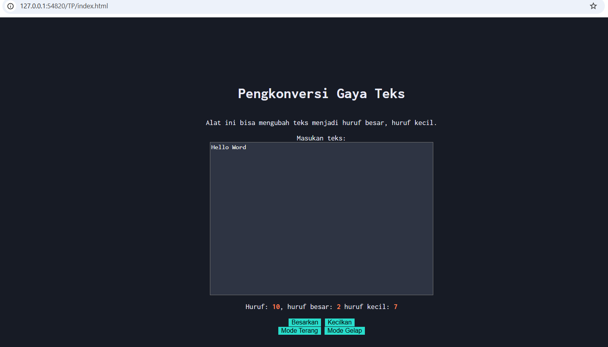

# Tugas Pendahuluan 04: Automata dan Table-Driven Construction
Nama: Steven Taufik Fajar
NIM: 103122400068
Kelas: SE-08-02

## Soal
Tambahkan mode gelap sekaligus untuk editor-kecil dan tombol-tombolnya. Ketentuan warna untuk latar belakang editor-kecil adalah #2e3443, sementara untuk tombol adalah #29ddcc. Teks untuk tombol tetap mengikuti warna teks sebelumnya.Untuk menghapus pinggiran tombol, nyatakan properti border untuk tidak ditunjukkan. Untuk menghapus pinggiran tombol, nyatakan properti border untuk tidak ditunjukkan.

## Program/kode
[index.html](./index.html) [index.css](./index.css) [index.js](./index.js)


## Output



## Deskripsi
(1) Program di bawah ini saya tambahkan, .dark-mode ini untuk membuat seluruh 
latar belakang web saya menjadi berwarna hitam atau gelap, .dark-mode .kotak-input
yang ini fungsinya untuk merubah warna latar kotak text yang kita inputkan menjadi 
abu ke biru biruan, .dark-mode button yang ini untuk sesuai namanya mengubah warna
di semua tombol atau button saya juga menghilangkan bordernya sesuai perintah di soal
```
.dark-mode {
    background-color: #171b25;
    color: #EBECF7;
}
.dark-mode .kotak-input{
    background-color: #2e3443;
    color: white;
}
.dark-mode button {
    background-color: #29ddcc;
    border: none;
}
```

