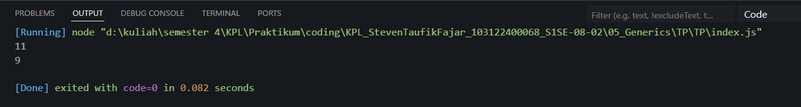

# Tugas Pendahuluan 05 : Generics
Nama: Steven Taufik Fajar
NIM: 103122400068
Kelas: SE-08-02

## Soal
Ini adalah kode yang mengurus jumlah semua karakter dan jumlah huruf:
```
const str = "Bar bar";

let jumlahSemua = 0;
for (const c of str) { 
    jumlahSemua++; 
}
console.log(total);

let jumlahHuruf = 0;
for (const c of str) { 
    if (c === ' ') continue;
    jumlahHuruf++;
}
console.log(letters);
```
Bagaimana caramu hanya dengan satu fungsi generik bisa mengurus keduanya?
Agar fungsi yang kamu kerjakan benar atau tidak, berikut ini adalah kode tes yang bisa kamu tempelkan:
```
const str = "Bar bar bar";
...
console.log(
   hitung(str, "semua") // Harusnya 11
);
console.log(
  hitung(str, "huruf") // Harusnya 9
);
hitung(str, "huruf"); // Tidak terjadi apa-apa
```
## Program/kode
[index.js](index.js)


## Output



## Deskripsi
di sini saya membuat function bernama hitung berparameter str, tipe 
lalu untuk menghitungnya saya menggunakan variabel jumlah yang isinya 0, 
setelah itu saya membuat looping untuk mencari nilainya dan if untuk menyeleksi 
spasi terakir saya meraturn variabel jumlah untuk hasilnya


