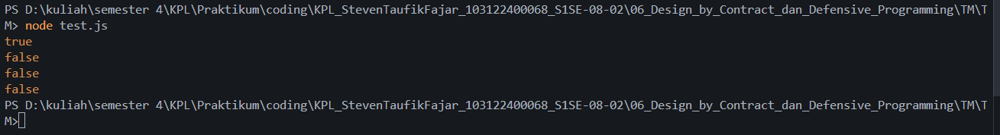

# Tugas Mandiri 06 : Design by Contract dan Defensive Programming
Nama: Steven Taufik Fajar
NIM: 103122400068
Kelas: SE-08-02

## Soal
Lindungi kode ini dari bilangan-bilangan "fizz buzz"!

Tugasmu adalah membuat fungsi yang menolak bilangan-bilangan kelipatan 3, 5, atau 15, menerima bilangan-bilangan bukan "fizz buzz", dan melempar yang bukan bilangan bulat.
```
function is_not_fizzbuzz(number) {
  // TODO
}

console.log(is_not_fizzbuzz(1)) // true
console.log(is_not_fizzbuzz(3)) // false
console.log(is_not_fizzbuzz(5)) // false
console.log(is_not_fizzbuzz(30)) // false
console.log(is_not_fizzbuzz(7)) // true
console.log(is_not_fizzbuzz(null)) // Lempar TypeError
console.log(is_not_fizzbuzz(NaN)) // Lempar TypeError
console.log(is_not_fizzbuzz(Infinity)) // Lempar TypeError
```

## Program/kode
[index.js](index.js)[test.js](test.js)


## Output



## Deskripsi
saya membuat function bernama zzzzOrNum berparameter value. Pertama saya menyertakan pengecekan awal untuk memastikan nilai yang dimasukkan benar-benar bilangan bulat murni, setelah itu saya menyusun percabangan logika if-else untuk memeriksa apakah angka tersebut merupakan kelipatan dari 15, 3, atau 5, dan terakhir saya me-return output berupa string FizzBuzz/Fizz/Buzz atau mengembalikan angka asalnya untuk hasil akhirnya, lalu saya membangun function utama bernama fizzBuzz dengan parameter sequence. Pertama saya melakukan pengecekan untuk memastikan bahwa data yang diinputkan wajib berwujud array, setelah itu saya menjalankan perulangan menggunakan metode .map() untuk mengeksekusi setiap elemennya melewati function zzzzOrNum sebelumnya, dan terakhir saya me-return kumpulan array baru hasil konversi tersebut sebagai jawaban akhirnya.


