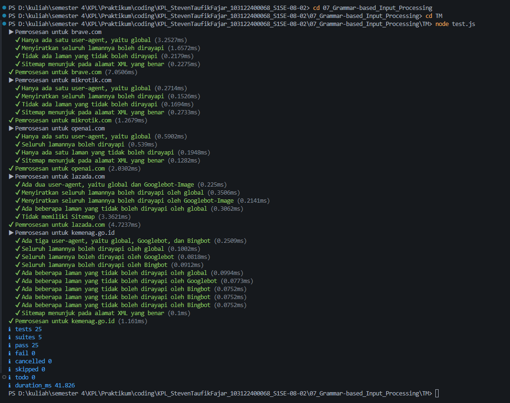

# Tugas Mandiri 06 : Grammar based Input Processing
Nama: Steven Taufik Fajar
NIM: 103122400068
Kelas: SE-08-02

## Soal
Tugas pada kesempatan kali ini adalah membuat fungsi yang menguraikan isi robots.txt menjadi POJO (plain old JavaScript object). Empat properti yang perlu diuraikan dijabarkan di bawah berikut.

User-agent adalah nama robot perayapnya
Allow adalah daftar halaman-halaman yang boleh dirayap
Disallow adalah daftar halaman-halaman yang tidak boleh dirayap
Sitemap adalah sebuah pranala yang menunjuk pada "denah" situs web (biasanya berformat XML)
Kamu akan mengerjakannya di dalam sebuah fungsi bernama parseRobots di index.js dan. Buka direktori 07 di sini untuk mengunduh berkas yang dimaksud, berkas-berikas robots.txt di dalam direktori daftar, dan berkas pengujiannya yaitu test.js.

Jadi, strukturnya harus seperti ini:
```
|   index.js
|   structure.d.ts // Opsional mau ada atau tidak
|   test.js
\---daftar
        brave.txt
        kemenag.txt
        lazada.txt
        mikrotik.txt
        nikkei.txt
        openai.txt
```

Agar kode yang kamu tulis di index.js bekerja atau tidak, jalankan test.js. Jika kamu membuat proyek Node (yang ada package.json), pastikan untuk membuat impor menjadi CommonJS dengan type: commonjs.
## Program/kode
[index.js](index.js)[test.js](test.js)


## Output



## Deskripsi
Saya membuat function bernama parseRobots berparameter txt. Pertama saya menginisialisasi awal untuk menyiapkan objek penampung bernama result serta membuat variabel state berupa array currentAgents dan boolean isAgentBlock untuk menangani kasus nama bot yang bertumpuk, setelah itu saya memecah isi teks tersebut menjadi baris-baris terpisah dan menjalankan perulangan for untuk mengeksekusi setiap baris yang sudah dibersihkan dari simbol komentar. Di dalam perulangan tersebut, saya menyusun percabangan logika if-else untuk mengumpulkan nama-nama bot ke dalam array penampung jika mendeteksi 'user-agent', mendistribusikan aturan akses secara berbarengan ke seluruh agen yang terkumpul tersebut jika mendeteksi 'allow' atau 'disallow', dan menyimpan datanya langsung ke objek utama jika mendeteksi 'sitemap' atau 'host', dan terakhir saya me-return objek result hasil penguraian struktur tersebut sebagai output hasilnya.

