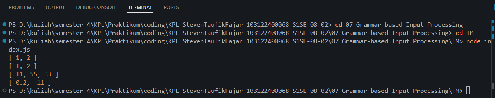

# Tugas Pendahuluan 07 : Grammar-based Input Processing
Nama: Steven Taufik Fajar
NIM: 103122400068
Kelas: SE-08-02

## Soal
Buatlah fungsi yang mengubah deretan angka bertipe string menjadi larik angka.
```
function toNumberArray(number) {
  // TODO
}

console.log(toNumberArray("1, 2")) // [1, 2]
console.log(toNumberArray(["1", "2"])) // [1, 2]
console.log(toNumberArray(" 11,55,33   ")) // [11, 55, 33]
console.log(toNumberArray(["0.2", "-11", "abc23"])) // [0.2, -11]
```


## Program/kode
[index.js](index.js)


## Output


## Deskripsi
Di sini saya membuat function bernama toNumberArray berparameter number. Pertama saya membuat validasi untuk memastikan inputnya berbentuk array dengan memecahnya jika ia masih berupa string, setelah itu saya memproses array tersebut secara berurutan menggunakan .map() untuk membersihkan spasi dan mengonversi teksnya menjadi angka, serta menggunakan .filter() untuk menyeleksi dan membuang teks yang kosong, dan terakhir saya memfilternya kembali untuk membuang hasil yang bukan angka (NaN) lalu me-return array baru tersebut untuk outputnya.


