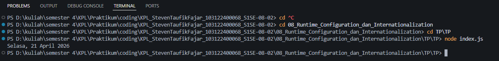

# Tugas Pendahuluan 08 : Runtime Configuration dan Internationalization
Nama: Steven Taufik Fajar
NIM: 103122400068
Kelas: SE-08-02

## Soal
Tampilkan tanggal sekarang dengan format seperti ini:

Sabtu, 18 April 2026
Nilai waktu tidak harus sama, asalkan formatnya benar dan bisa tampil di komputer terpisah pada waktu tertentu. Gunakan Intl.DateTimeFormat (bukan string manual).
## Program/kode
[index.js](index.js)

## Output

## Deskripsi
new Date(): fungsinya untuk Mengambil informasi tanggal dan waktu saat kode dijalankan di komputer.
weekday: 'long' (Hari)
day: 'numeric' (Tanggal)
month: 'long' (Bulan )
year: 'numeric' (Tahun)

