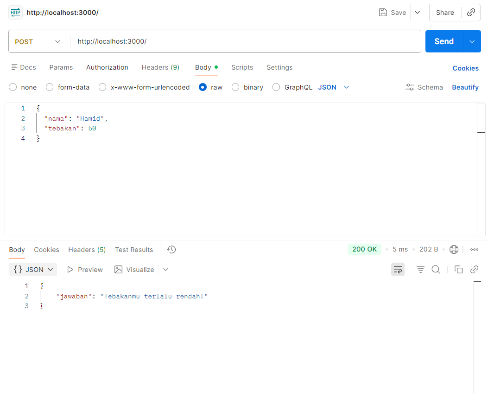
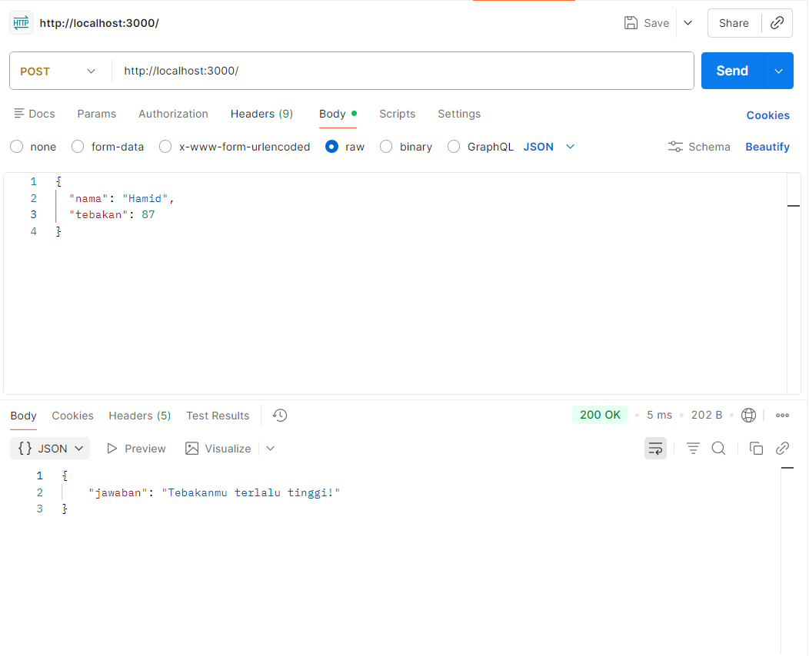

# Tugas Mandiri 09 :9_API_Design_dan_Construction_Using_Swagger
Nama: Steven Taufik Fajar
NIM: 103122400068
Kelas: SE-08-02

## Soal
Tugasmu adalah membuat API yang terdiri dari satu endpoint saja, yaitu POST /. Ketika kita melakkukan POST, formatnya adalah seperti di bawah ini.
```
{
  "nama": "Hamid",
  "tebakan": 24
}
```
Jika tebakan benar.
```
{
    "jawaban": "Benar sekali! Tebakannya adalah 24."
}
```
Jika tebakan terlalu tinggi.
```
{
    "jawaban": "Tebakanmu terlalu tinggi!"
}
```
Jika tebakan terlalu rendah.
```
{
    "jawaban": "Tebakanmu terlalu rendah!"
}
```
Beberapa aturan:

Angka acak yang dihasilkan harus tetap dan tidak boleh berubah setiap kali permintaan API dilakukan, tetapi boleh berubah setiap harinya atau dibuat tetap selamanya
Rentang harus di antara 1-100
Nama harus sensitif terhadap besar kecil huruf (mis. hamid dan Hamid akan menghasilkan angka acak yang berbeda)
Tidak menggunakan pustaka apapun, murni mengandalkan nama dan tebakan
Penjelasan untuk nomor 1: Jika namanya Hamid, ia akan diharapkan tetap pada nilai tebakan 24 mau kamu melakukan 100 kali permintaan. Tidak ada jawaban benar di sini (Hamid tidak harus 24, bebas mau dibuat acak seperti apa yang penting harus tetap).
## Program/kode
[server.js](server.js)


## Output




## Deskripsi
Program ini membaca data JSON dari request body pada endpoint **POST /** untuk mengambil *nama* dan *tebakan*. Nama diproses dengan penjumlahan nilai ASCII dan operasi modulus untuk menghasilkan angka rahasia (1–100). Angka tersebut kemudian dibandingkan dengan tebakan pengguna, lalu hasilnya (terlalu tinggi, rendah, atau benar) dikirim kembali dalam bentuk respons JSON.


