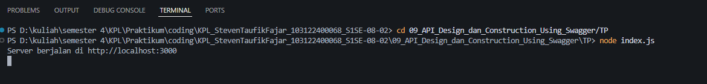
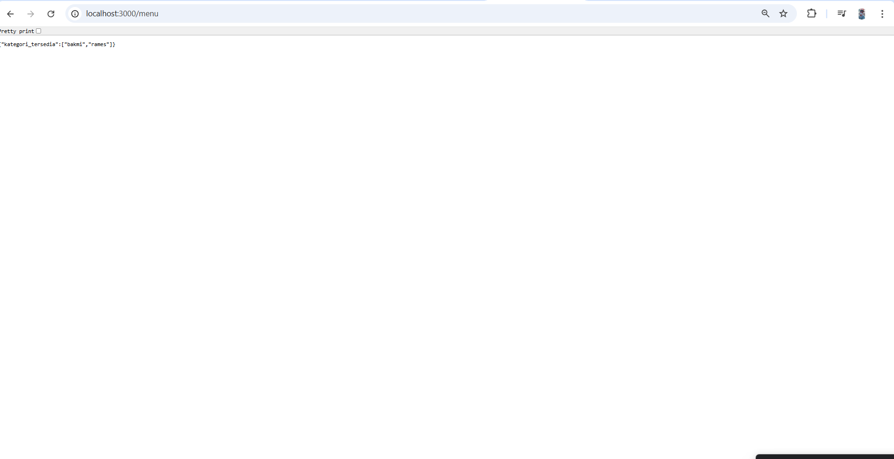
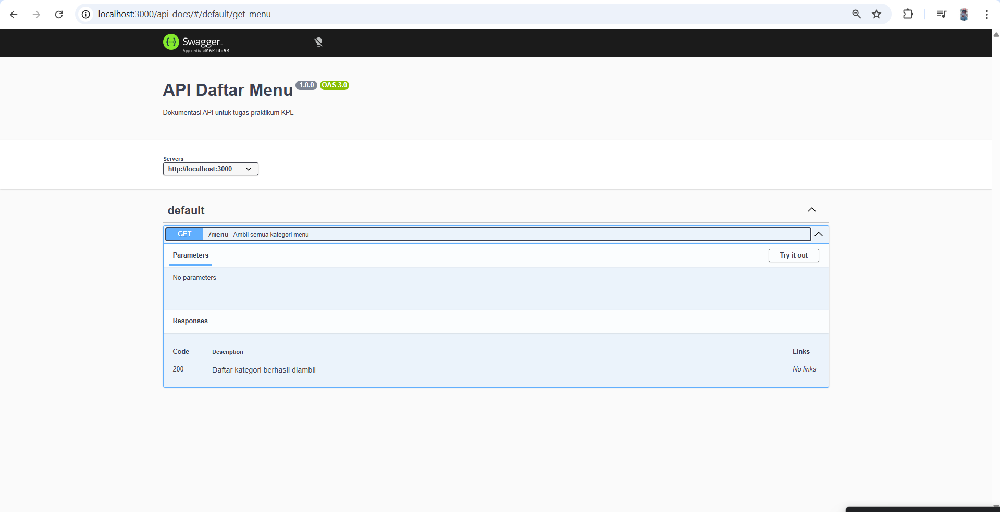

# Tugas Pendahuluan 09 : 09_API_Design_dan_Construction_Using_Swagger
Nama: Steven Taufik Fajar
NIM: 103122400068
Kelas: SE-08-02

## Soal
Buatlah satu endpoint lagi beserta dokumentasi OpenAPI-nya, yaitu GET /menu yang menampilkan daftar semua nama kategori menu yang ada.

## Program/kode
[index.js](index.js)

## Output

## Deskripsi
saya menggunakan framework Express.js untuk membuat endpoint API GET / menampilkan daftar kategori makanan barformat JSON dan mengintegrasikan standar OpenAPI melalui library swagger-jsdoc dan swagger-ui-express tujuannya agar dapat mengakses data kategori melalui URL /menu dan meninjau struktur serta spesifikasi API tersebut melalui antarmuka visual Swagger di jalur /api-docs.

