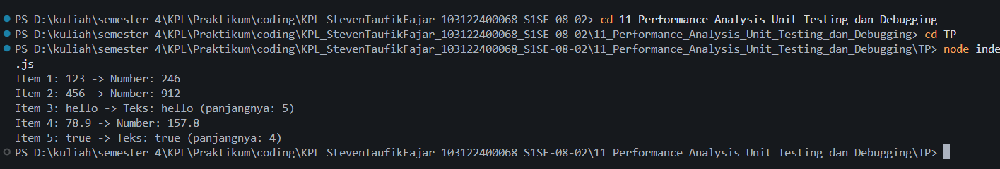

# Tugas Pendahuluan 11 : Performance_Analysis_Unit_Testing_dan_Debugging
Nama: Steven Taufik Fajar
NIM: 103122400068
Kelas: SE-08-02

## Soal
Cobalah untuk menangkap kecacatan dalam kode ini
```
function main() {
  const data = [
    "123",
    456,
    "hello",
    78.9,
    true,
  ];

  for (let i = 0; i < data.length; i++) {
    const result = processData(data[i]);
    console.log(`Item ${i + 1}: ${data[i]} -> ${result}`);
  }
}

function processData(data) {
  const str = data.toLowerCase();
  const num = parseInt(str);
  if (!isNaN(num) && str === String(num)) {
    return `Number: ${num * 2}`;
  }
  return `Teks: ${str} (panjangnya: ${str.length})`;
}

main();
```
## Program/kode
[index.js](index.js)


## Output


## Deskripsi
Error ada di baris const str = data.toLowerCase(); dalam fungsi processData. Ada dua sumber masalah
Pertama, karena tipe data di array data nggak seragam—ada string, number, dan boolean. Padahal toLowerCase() cuma bisa dipanggil dari string. Saat program nemu angka (456, 78.9) atau boolean true, error langsung muncul: TypeError: data.toLowerCase is not a function.
Kedua, penggunaan parseInt(str) bikin angka desimal seperti 78.9 dipotong jadi 78. Akibatnya, perbandingan "78.9" === "78" jadi false, dan angka desimal gagal dikenali dengan benar.


